# Sparkathon 

## Theme
Sustainable future

## Team Members
- Ganesh Sai
- Santhosh M
- Amareshwar A
  
## Video Demo ([Video Link](https://youtu.be/8f_pgriY-nY))

## Presentation
[Link to PPT](https://drive.google.com/file/d/1COcXWtlOmL6909NN8mqOmCaeMIjnhsyf/view?usp=sharing)

## Problem Statement

In this environmentally focused theme, the challenge is to create a platform where Walmart prioritizes sustainable and eco-friendly products, and optimize the supply chain to reduce carbon footprint and promote zero waste or biodegradable packaging.

## What it does?
1. Eco-Friendly products based Scoring and Sorting System
2. AI Chatbot Integration with Personalized Recommendations
3. Green Score & discount coupons
4. Carbon Off setting Fee
5. Consumer Education Hub

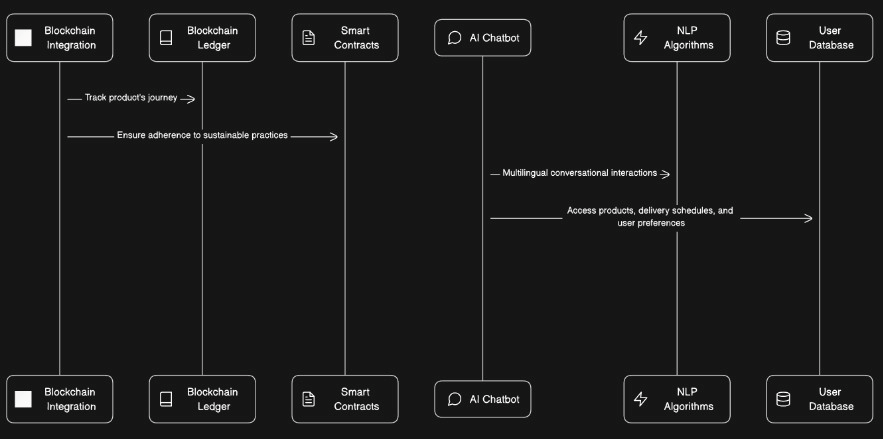
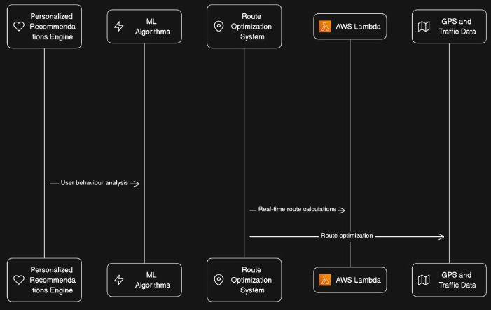

## Tech Stack
1. ReactJS
2. HTML
3. CSS
4. JavaScript
5. NodeJS
6. ExpressJS
7. Python
8. Firebase

## How to use it?
1. Use `npm install` to install all the dependencies.
2. Use `npm start` to start the server.
3. Do they steps seperately for both the folders i.e. `frontend` and `server`.

## Screenshots

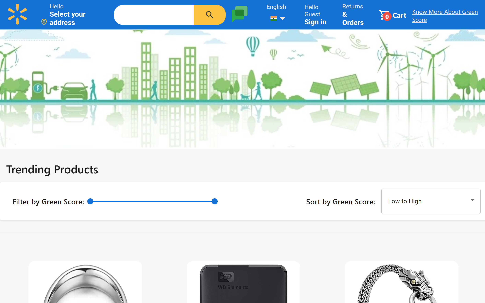

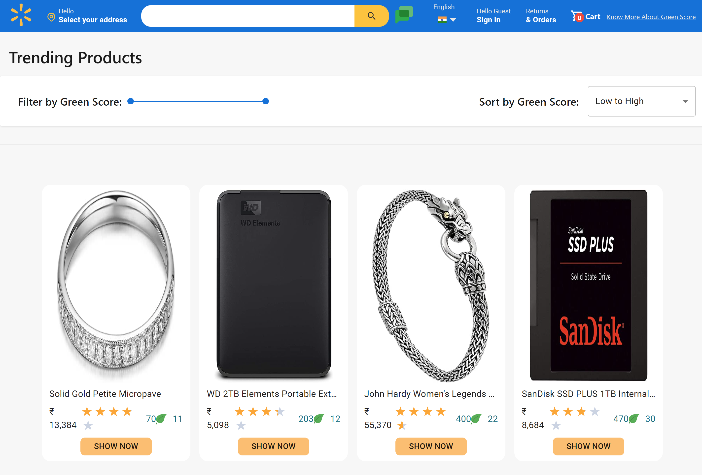

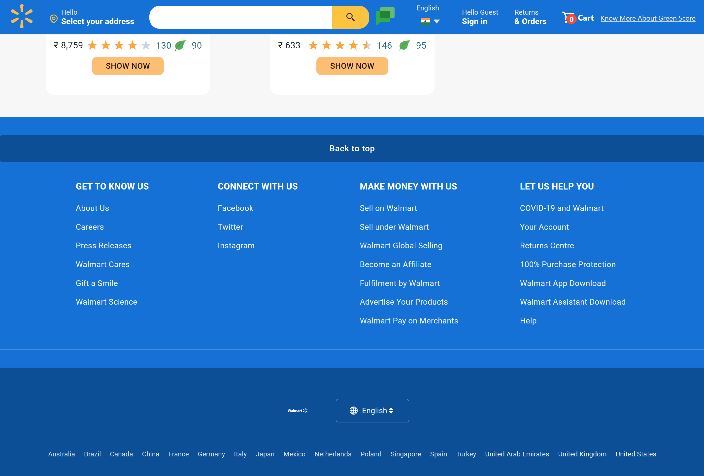
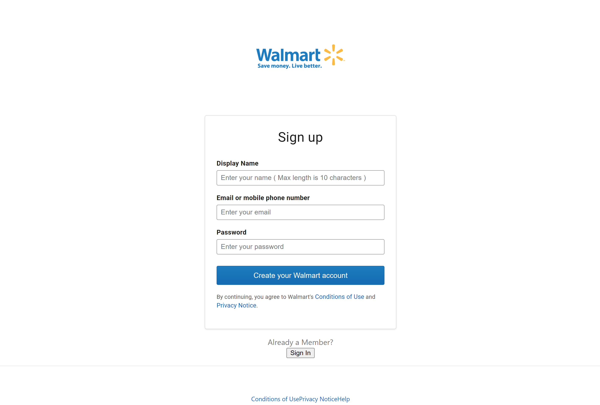
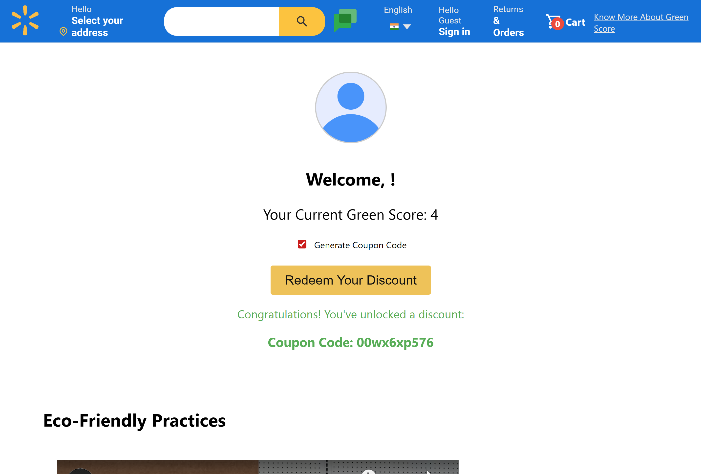

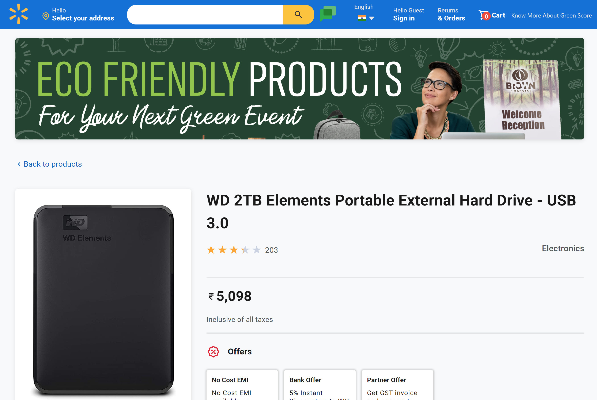
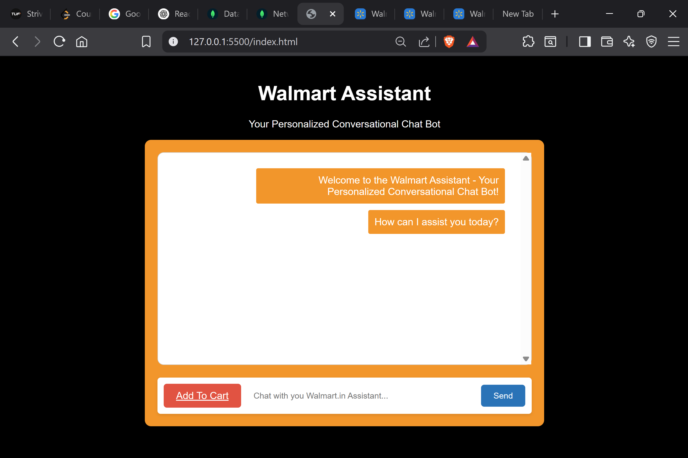
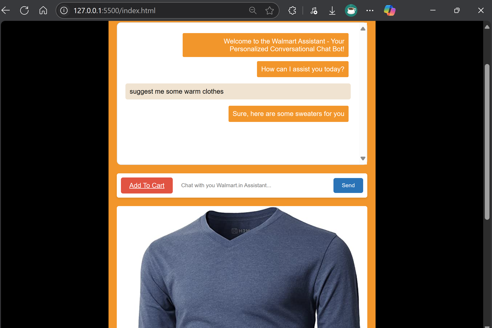
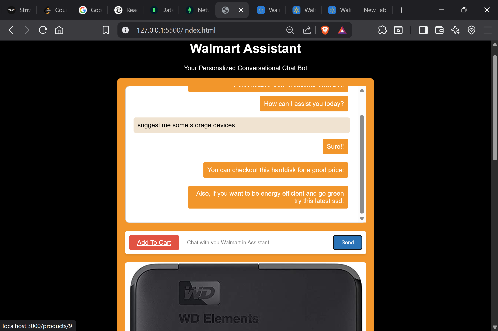
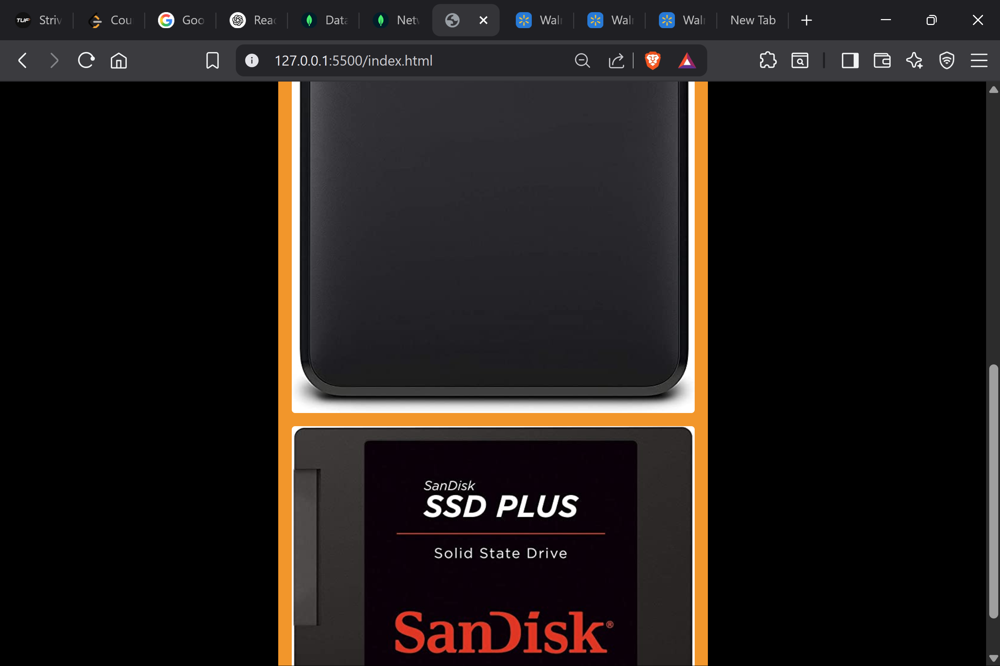

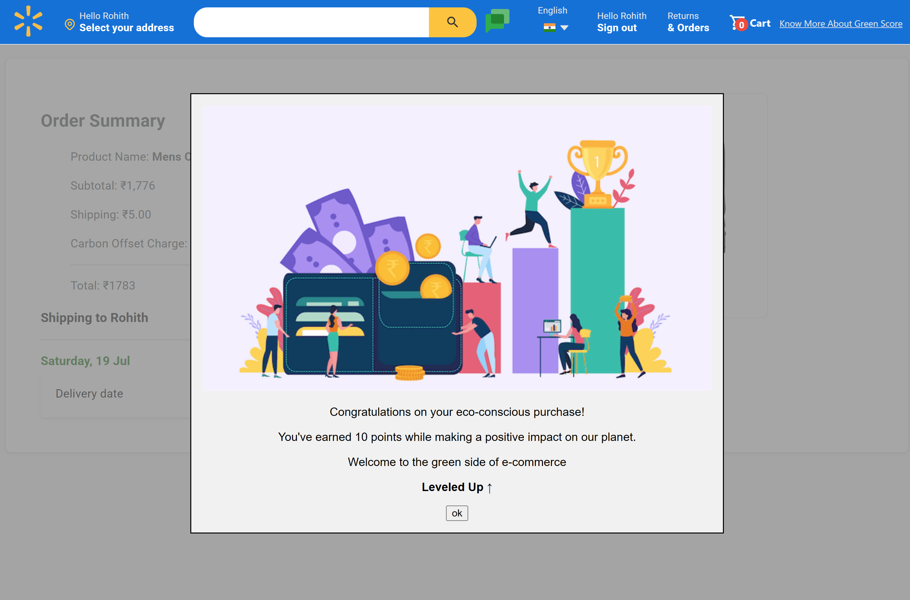
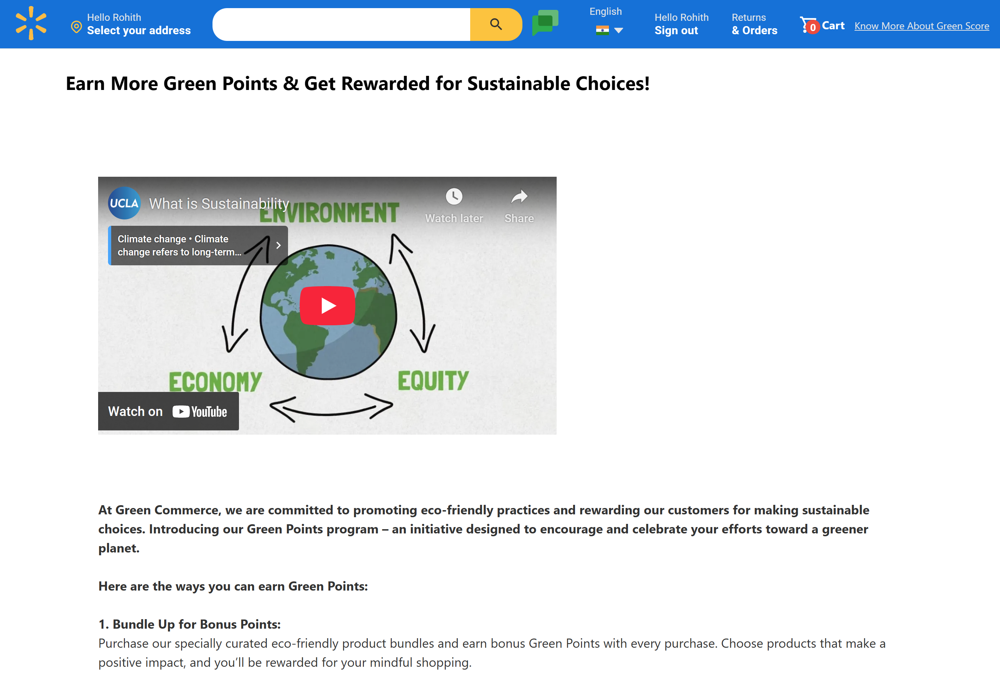

